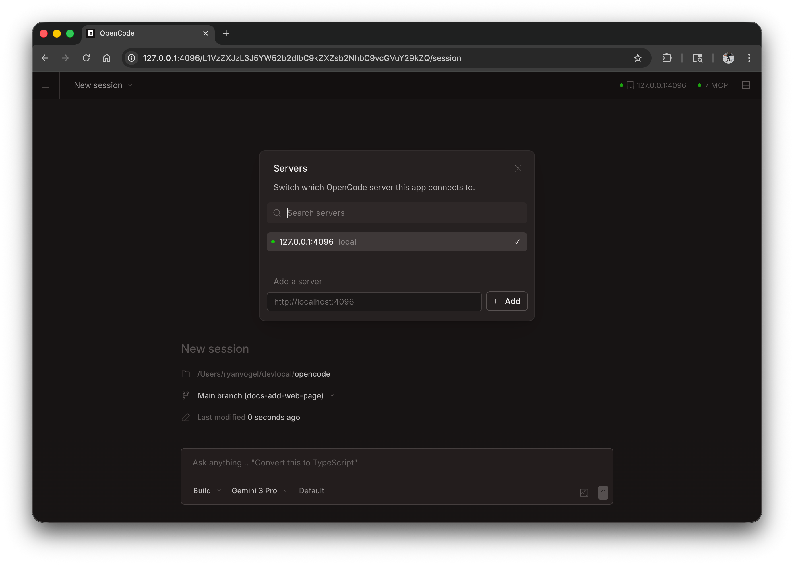

impactr может работать как веб-приложение в вашем браузере, обеспечивая такой же мощный опыт кодирования AI без необходимости использования терминала.


## Начало работы

Запустите веб-интерфейс, выполнив:

```bash
impactr web
```

Это запустит локальный сервер `127.0.0.1` со случайным доступным портом и автоматически откроет impactr в браузере по умолчанию.

:::caution
Если `IMPACTR_SERVER_PASSWORD` не установлен, сервер будет незащищен. Это подходит для локального использования, но его следует настроить для доступа к сети.
:::

:::tip[Пользователи Windows]
Для получения наилучших результатов запустите `impactr web` из [WSL](/docs/windows-wsl), а не из PowerShell. Это обеспечивает правильный доступ к файловой системе и интеграцию терминала.
:::

---

## Конфигурация

Вы можете настроить веб-сервер с помощью CLI-флагов или в файле [config file](/docs/config).

### Порт

По умолчанию impactr выбирает доступный порт. Вы можете указать порт:

```bash
impactr web --port 4096
```

### Имя хоста

По умолчанию сервер привязывается к `127.0.0.1` (только локальный хост). Чтобы сделать impactr доступным в вашей сети:

```bash
impactr web --hostname 0.0.0.0
```

При использовании `0.0.0.0` impactr будет отображать как локальные, так и сетевые адреса:

```
  Local access:       http://localhost:4096
  Network access:     http://192.168.1.100:4096
```

### Обнаружение mDNS

Включите mDNS, чтобы ваш сервер был доступен для обнаружения в локальной сети:

```bash
impactr web --mdns
```

Это автоматически устанавливает имя хоста `0.0.0.0` и объявляет сервер как `impactr.local`.

Вы можете настроить доменное имя mDNS для запуска нескольких экземпляров в одной сети:

```bash
impactr web --mdns --mdns-domain myproject.local
```

### CORS

Чтобы разрешить дополнительные домены для CORS (полезно для пользовательских интерфейсов):

```bash
impactr web --cors https://example.com
```

### Аутентификация

Чтобы защитить доступ, установите пароль, используя переменную среды `IMPACTR_SERVER_PASSWORD`:

```bash
IMPACTR_SERVER_PASSWORD=secret impactr web
```

Имя пользователя по умолчанию — `impactr`, но его можно изменить с помощью `IMPACTR_SERVER_USERNAME`.

---

## Использование веб-интерфейса

После запуска веб-интерфейс предоставляет доступ к вашим сеансам impactr.

### Сессии

Просматривайте свои сеансы и управляйте ими с главной страницы. Вы можете видеть активные сеансы и начинать новые.


### Статус сервера

Нажмите «Просмотреть серверы», чтобы просмотреть подключенные серверы и их статус.



---

## Подключение терминала

Вы можете подключить TUI терминала к работающему веб-серверу:

```bash
# Start the web server
impactr web --port 4096

# In another terminal, attach the TUI
impactr attach http://localhost:4096
```

Это позволяет вам одновременно использовать веб-интерфейс и терминал, используя одни и те же сеансы и состояние.

---

## Конфигурационный файл

Вы также можете настроить параметры сервера в файле конфигурации `impactr.json`:

```json
{
  "server": {
    "port": 4096,
    "hostname": "0.0.0.0",
    "mdns": true,
    "cors": ["https://example.com"]
  }
}
```

CLI-флаги имеют приоритет над настройками файла конфигурации.
