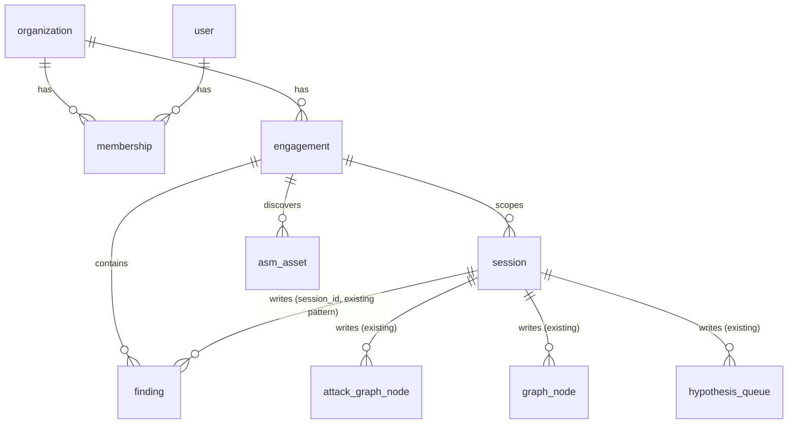

## tenant/organization data model

Design + migration plan for the MVP tenant model (issue #2). This is a design document only —
no migration files or `*.sql.ts` tables land here; implementation is issue #3 (persistence),
issue #5 (auth), and issue #8 (engagement audit trail), each referencing the shapes below.

### Why

Every other MVP gap depends on this. Today there is no tenant/organization/client concept
anywhere in the pentest engine: Attack Graph, Knowledge Graph, and the hypothesis queue
(`packages/core/src/attack-graph`, `packages/core/src/knowledge`) are scoped only by `session_id`,
and `draft_vulnerability` writes findings as flat markdown files under `findings/`
(`packages/core/src/tool/draft-vulnerability.ts`) rather than DB rows. Neither is queryable by a
hosted dashboard, and neither is scoped to a client.

### Not to be confused with

`Org`, `Account`, and `Workspace` already mean something else in this codebase. None of them are
the security-client tenant this doc defines:

- `packages/core/src/account.ts` (`AccountV2`) + `account/sql.ts` — the CLI's own login identity to
  the Impactr control plane (OAuth tokens, `active_org_id`). This is developer/billing identity,
  not a pentest client.
- `packages/core/src/control-plane/workspace.sql.ts` — a local dev worktree/sandbox tied to a
  `project_id`. Unrelated to tenancy.
- `packages/console` — a separate app with its own MySQL DB (`WorkspaceTable`/`UserTable` for
  billing tenants). Different application, different database. No literal naming collision with
  the tables below, but don't conflate the two "workspace"/"user" concepts.

`Organization`, `Engagement`, `Membership`, `Asset`, and `Tenant` are unclaimed repo-wide, which is
why they're used below.

### Entities

New module `packages/core/src/organization/` (mirrors the existing `session/`, `project/`,
`attack-graph/` module shape: `export * as OrganizationSchema` from `schema.ts`, Drizzle tables in
`sql.ts`, branded `ID` types sourced from a new `@impactr-ai/schema/organization`-style leaf,
`...Timestamps` spread from `database/schema.sql.ts`). New ID prefixes to add to `id/id.ts`'s
`prefixes` map: `org`, `usr`, `eng`.

**`organization`** — the security client/tenant.

| column | type | notes |
|---|---|---|
| id | text PK | |
| name | text | |
| slug | text, unique | URL-safe, for dashboard/API path scoping |
| ...Timestamps | | |

**`user`** — a dashboard login identity. Distinct from `packages/core`'s CLI `account` table and
from console's billing `UserTable`. Auth mechanics (password/OAuth/session) are issue #5's job —
this table only fixes the shape `membership` needs.

| column | type | notes |
|---|---|---|
| id | text PK | |
| email | text, unique | |
| name | text | |
| ...Timestamps | | |

**`membership`** — join table, one row per (user, organization) with a role.

| column | type | notes |
|---|---|---|
| organization_id | text, FK → organization, cascade | part of composite PK |
| user_id | text, FK → user, cascade | part of composite PK |
| role | text: `"owner" \| "admin" \| "member"` | |
| ...Timestamps | | |

**`engagement`** — the authorized scope record. This table defines shape and relations only; the
full approval **audit trail** (history of scope changes/approvals) is issue #8's table to add on
top of this one, not part of this design.

| column | type | notes |
|---|---|---|
| id | text PK | |
| organization_id | text, FK → organization, cascade | |
| name | text | |
| status | text: `"draft" \| "authorized" \| "active" \| "completed" \| "revoked"` | |
| scope | json | target + exclusions, same shape as today's ad hoc scope file (`{ target: { name, scope, exclusions, ... } }`) |
| authorized_by | text, nullable FK → user | approver |
| authorized_at | integer, nullable | |
| ...Timestamps | | |

**`session.engagement_id`** — new **nullable** FK added to the existing `session` table
(`packages/core/src/session/sql.ts`). Nullable because the leftover, not-yet-decommissioned
opencode coding-assistant sessions (issue #14, p2-later) have no engagement. Pentest sessions get
this set when the orchestrator starts an engagement.

**`asm_asset`** (shape only, consumed by issue #7's dashboard view) — recon output, not yet
modeled anywhere in the app-facing surface today.

| column | type | notes |
|---|---|---|
| id | text PK | |
| engagement_id | text, FK → engagement, cascade | |
| type | text: `"domain" \| "subdomain" \| "ip" \| "url" \| "service"` | |
| value | text | e.g. hostname |
| attributes | json | ports, tech fingerprint, etc. |
| discovered_at | integer | |
| ...Timestamps | | |

**`finding`** (shape only, target of issue #3's markdown→DB migration and issue #6's dashboard) —
replaces the flat `findings/*.md` files written by `draft_vulnerability`.

| column | type | notes |
|---|---|---|
| id | text PK | |
| session_id | text, FK → session, cascade | matches the existing `graph_node` pattern — unchanged |
| engagement_id | text, FK → engagement, cascade | denormalized, see below |
| title | text | |
| description | text | |
| cvss | text | |
| impact | text | |
| remediation | text | |
| status | text | e.g. triage state for the dashboard |
| severity | text | |
| assigned_to | text, nullable FK → user | |
| ...Timestamps | | |

### Tenant-scoping rule

`attack_graph_node`, `graph_node`, `hypothesis_queue`, and the new `finding` table each get a
**denormalized `engagement_id` column**, in addition to their existing `session_id`, rather than
relying on a `session → engagement → organization` join for every tenant-scoped query.

Why denormalize instead of joining through session:

- Issue #3's own scope explicitly lists these four tables for org-scoping.
- The dashboard/API (#4, #6, #7) needs one direct `WHERE engagement_id = ?` per table. On a
  security dashboard, a missed join is a cross-tenant data leak — "every tenant-scoped table is
  directly filterable" is worth the one extra column.
- `engagement_id`, not `organization_id`, is the denormalized key, because engagement is the
  operational scope boundary. `organization_id` is one more hop away
  (`engagement.organization_id`) for the rarer "across all of this org's engagements" queries.
- Row-level `engagement_id` is derived from the owning session's `engagement_id` at write time.
  This is a note for #3/#4 to implement — not implemented here.

### ER diagram

### Migration plan (for issue #3 to execute)

Ordered steps, no code included here:

1. Add `organization`, `user`, `membership`, `engagement`, `asm_asset`, `finding` tables.
2. Add nullable `session.engagement_id` (FK → engagement).
3. Backfill: existing local single-tenant installs leave `engagement_id` null everywhere (no
   backfill needed — they stay tenant-less/local). The hosted multi-tenant DB starts fresh, so no
   migration of existing rows into an organization is required there either.
4. Add `engagement_id` to `attack_graph_node`, `graph_node`, `hypothesis_queue`.
5. Migrate existing `findings/*.md` content into the new `finding` table (one-time data migration,
   not a schema migration — parse the markdown `draft_vulnerability` already writes: title, CVSS,
   description, impact, remediation sections).

### Non-goals of this design

- No `*.sql.ts` Drizzle tables added to `packages/core/src` yet — wiring these in now would be a
  half-finished implementation ahead of issue #3, which owns that step.
- No migration files under `packages/core/src/database/migration/`.
- No auth/login implementation (issue #5).
- No engagement audit-trail log table (issue #8) — this doc only reserves the fields #8 needs to
  hang its record off (`engagement.status`, `authorized_by`, `authorized_at`).
